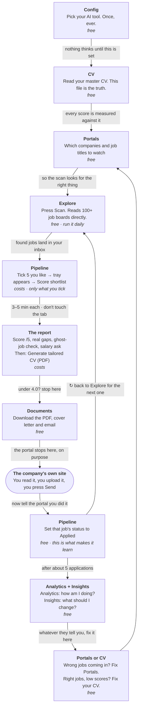
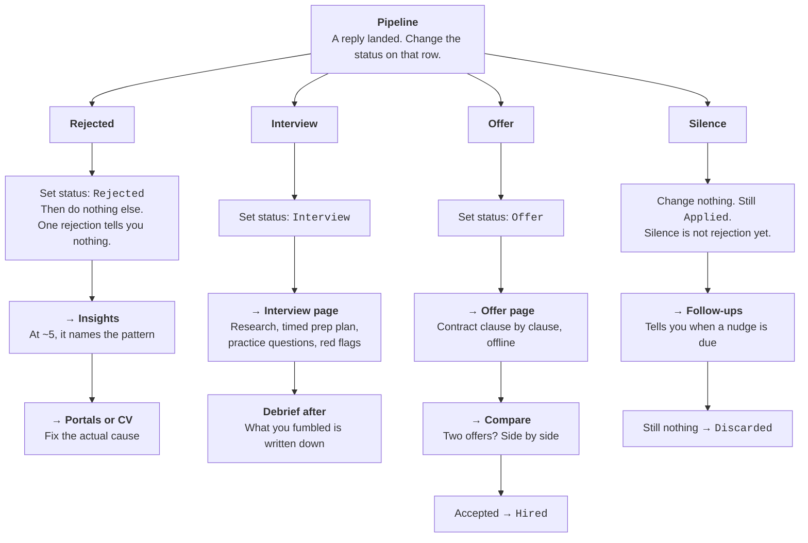

# I have a CV. I want a job.

That is genuinely all you need to know to start. This page explains what Jobsmith
does for you, in the order it does it — starting tonight.

---

## What it takes off your plate

A job search is four jobs at once: finding openings, working out which ones are
worth your evening, rewriting your CV for each, and remembering who you sent what
to. Most people do the first, skip the second, rush the third, and lose track of
the fourth.

**It does this**

- **Finds jobs before they reach LinkedIn.** Reads 100+ company career pages
  directly, so you see postings hours old, not weeks old and buried under 900
  applicants.
- **Tells you honestly if you'd get it.** A score out of 5 against your real CV,
  with the requirements you actually miss written down plainly.
- **Spots the fake ones.** Ghost jobs, scams, roles reposted every three months
  with no intention of hiring.
- **Writes the paperwork.** Your CV rewritten for that one job, plus a cover
  letter and an application email — without inventing anything about you.
- **Tells you what to ask for.** A salary range and a single figure for the form,
  researched against the role's own market.
- **Remembers everything.** Who you applied to, who has gone quiet, and after a
  handful of applications, why you are being rejected.

**It does not do this**

- **It does not apply for you.** Ever. It drafts, you read, you press send on the
  company's own site. That is a deliberate choice, not a missing feature.
- **It does not make you look better than you are.** If a posting wants
  Kubernetes and you have never touched it, the generated CV leaves it out and
  the report tells you it is missing.
- **It does not mass-apply.** There is no "apply to 200 jobs" button and there
  never will be. Five good applications beat fifty generic ones.
- **It does not know anything you have not told it.** Everything comes from your
  CV file. Nothing is guessed.

### The one rule that explains everything else

**Looking is free. Thinking costs.**

Finding hundreds of jobs costs nothing — it is just reading web pages. Reading a
job properly, against your CV, uses AI and costs a small amount. So the whole
tool is a funnel: scan wide for free, throw most of it away by eye, and only pay
for the few you would genuinely apply to.

---

## The map: which screen, in what order, and why

The label on each arrow is the *reason* you move — usually the bit that is
missing when a tool feels confusing.

Rounded box = **you** do it, outside the portal.

---

## A company replied — now where?

Everything starts in the same place: open **Pipeline** and change that job's
status. The status is not paperwork — it is the switch that decides what the
portal does for you next.

### Why the status matters more than it looks

Setting a status takes two seconds and feels like admin. It is the whole engine.
**Analytics** and **Insights** can only tell you why you are being rejected if
they know what happened; **Follow-ups** can only chase people if it knows who is
still open. Skip the statuses and this is just a document generator.

---

## Tonight, start to finish

At the end of this you will have sent one real, properly-tailored application.

### Minute 0 — Tell it which AI to use · *free*

Your AI CLI is already installed and the portal can see it, but the *browser* has
to be told once, and it starts blank. Skip this and every clever button fails
with `No CLI configured`. This is the most common way people get stuck on day one.

1. Sidebar → **Config**
2. Pick your CLI (Claude Code, Codex, OpenCode…)
3. Save. Done forever.

> The setting is stored per web address. If you run a second copy on another
> port, that one needs setting too.

### Minute 2 — Read your own CV once · *free*

`cv.md` **is** the truth as far as the portal is concerned. Every score and every
generated document reads it and nothing else.

- Sidebar → **CV** → read it
- Something wrong? Tell the assistant in plain English and it edits the file

### Minute 5 — Go and find jobs · *free*

Goes out to Greenhouse, Lever, Ashby, Workday and dozens of other boards, pulls
everything matching your target roles, and throws away anything it has already
shown you.

1. Sidebar → **Explore**
2. Press **Scan**
3. Wait a minute or two

> **What you will see:** a pile of jobs, possibly hundreds. That is normal and it
> is not the point — the good ones are in there and the next step finds them.

### Minute 10 — Pick five by eye, then let it judge them · *costs*

**This is the step nobody finds on their own.** There is no "score" button on an
individual job. You tick the ones you like, and a tray appears at the bottom of
the screen with the scoring button in it. It works that way on purpose — so you
cannot accidentally spend money scoring four hundred jobs.

1. Sidebar → **Pipeline**
2. Skim the titles. **Tick five** worth an evening
3. A tray slides up from the bottom showing what you ticked
4. Press **Score shortlist** in that tray
5. **Now leave the tab alone.** Three to five minutes per job

> **What you get back:** a score out of 5, the requirements you genuinely do not
> meet, whether the posting looks real or like a ghost job, a salary
> recommendation, and a plain verdict. Under 4.0 it will tell you not to bother.

### Minute 35 — Make the documents · *costs*

Open the highest score. You get your CV rewritten around that job's language and
priorities. A check runs before it renders and refuses to include anything it
cannot trace back to your real CV.

1. In **Pipeline**, click the job to open its report
2. Read the **Verdict** at the top
3. Press **Generate tailored CV (PDF)**
4. Optionally **Cover letter** and **Application email**

Everything lands in **Documents**.

### Minute 50 — Send it yourself · *free*

The portal stops here, deliberately. Read what it wrote — you are the one who has
to defend it in an interview — then apply on the company's own site.

1. Press **Open job posting**, or download the PDF from **Documents**
2. Apply on the company's careers page
3. Back in **Pipeline**, set that job to **Applied**

That last click matters more than it looks. It is what turns this from a document
generator into something that learns.

---

## What to say when they ask about salary

Every scored job carries a researched recommendation, because "what are your
salary expectations?" is asked in the first screening call and is the one number
you cannot look up quickly.

You get a **range** for conversation, a **single figure** for forms that reject a
range, and three ready-to-use sentences — spoken, written, and single-figure.

**The rule that matters most:** the figure is anchored to the **role's** market,
never yours. If you live somewhere cheaper than the job, anchoring on your own
salary names a number far below what the employer already budgeted, and you
cannot walk it back later. The card always tells you which market it used.

Set `compensation.minimum` in `config/profile.yml` if you want a hard floor it
will never quote below.

---

## Every page, one line each

You only need the first six for a normal week. The rest wait until someone
replies.

| Page | What it is for | Cost |
|---|---|---|
| **Today** | Home. The one thing to do next, and anything waiting on you | free |
| **Explore** | Find new jobs. `Scan` is free; `AI search` hunts wider and costs | mixed |
| **Pipeline** | Everything found and everything sent. Shortlist, score, set statuses | mixed |
| **Documents** | Every PDF, cover letter and report. Download them here | free |
| **Follow-ups** | Who has gone quiet, and when to chase | free |
| **Portals** | Which companies and job titles the scanner looks for | free |
| **Analytics** | Your numbers — applied, replied, interviewed, where the funnel leaks | free |
| **Insights** | Your lessons — missing skills, time-wasting companies, pay gaps | free |
| **CV** | Your master CV, the one file everything is built from | free |
| **Profile** | Your targeting — roles, locations, sponsorship, salary | free |
| **Interview** | Research, prep plan, practice questions, red flags, debrief | costs |
| **Compare** | Two to six roles side by side when you cannot decide | costs |
| **Offer** | Contract read clause by clause, with no internet access | costs |
| **Config** | Pick your AI, set your details. Day one starts here | free |

**Analytics vs Insights, in one line:** Analytics answers *"how am I doing?"* —
counts and rates. Insights answers *"what should I change?"* — the skills you
keep missing, the companies that waste your time. Both stay quiet until there is
enough data to be honest, which is around five applications.

---

## If something looks broken

<b>"AI not setup" or "No CLI configured"</b>

The browser does not know which AI to use. **Config → pick your CLI → Save.**

Stored per web address, so a second copy on another port needs its own.

<b>"Interrupted (page reloaded)"</b>

The job was killed, not failed. Scoring takes minutes and the work lives in your
browser tab, so reloading or closing that tab stops it dead. Nothing is lost but
the time. Start it again and leave the tab alone — switching to other apps is
fine, only *that tab* matters.

<b>The scan found nothing new</b>

It remembers everything it has shown you, so a second scan an hour later is meant
to be quiet.

If it is *always* empty, your filters are too tight. Open **Portals** — usually
one word in the exclude list is eating real matches.

<b>Analytics or Insights says there is not enough data</b>

Working correctly. Computing a percentage from three applications would be a
made-up number. Log around five and both pages fill in.

<b>Scoring is taking forever</b>

Three to five minutes per job is normal, and a heavy posting can take nine. It
reads the posting, opens the live page to check the job still exists, reads your
CV, researches pay, and writes a full report. Score five at once and go make tea.

<b>A job scored lower than I expected</b>

Read the gaps it listed. If it is wrong about you, the fix is usually that your
CV does not mention something you have actually done. Tell the assistant, it
updates `cv.md`, and future scores improve.

---

## Where your data lives

No database, no server, no account. Plain files on your machine:

| Path | What |
|---|---|
| `data/applications.md` | Your tracker — a markdown table |
| `data/pipeline.md` | Jobs found, waiting for you |
| `data/follow-ups.md` | When to chase people |
| `data/scan-history.tsv` | Every job ever seen, so none repeats |
| `reports/` | Your full evaluations |
| `output/` | Generated CVs, cover letters, emails |

`data/applications.db` is a rebuildable SQLite cache for fast queries — delete it
and `node tracker.mjs sync` rebuilds it from the markdown. The markdown always
wins.

All of it is gitignored. Backup is a copy-paste of `data/`, `reports/`,
`output/`, `cv.md` and `config/profile.yml`.
